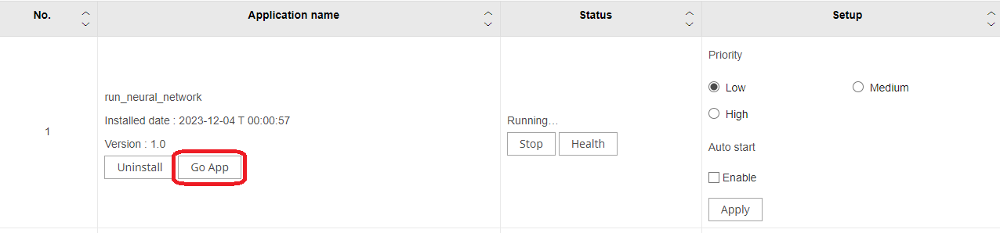
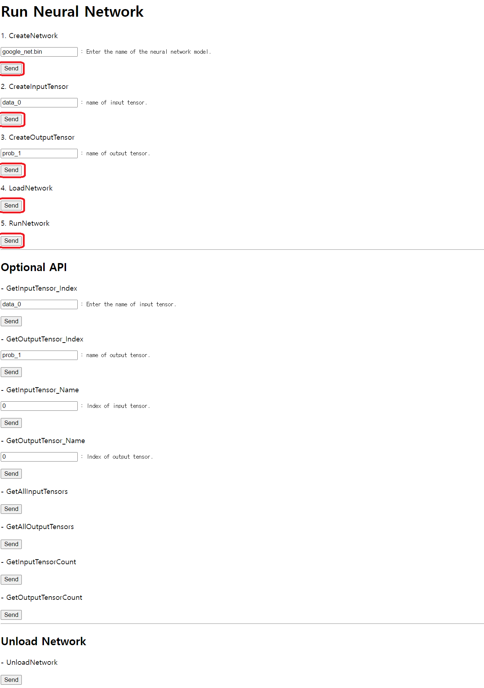
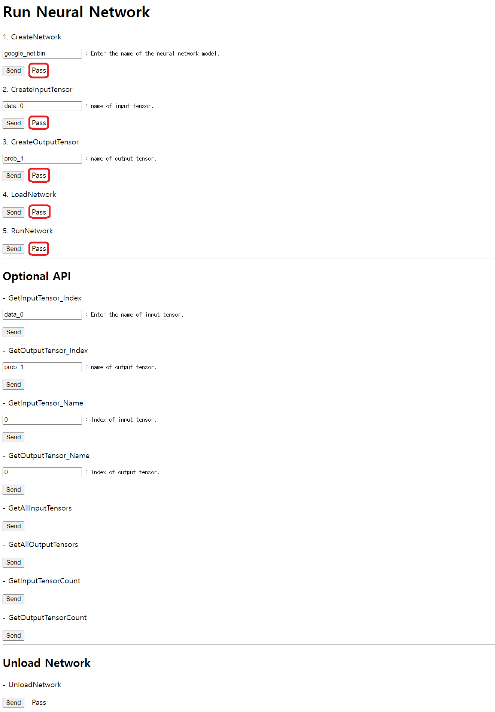
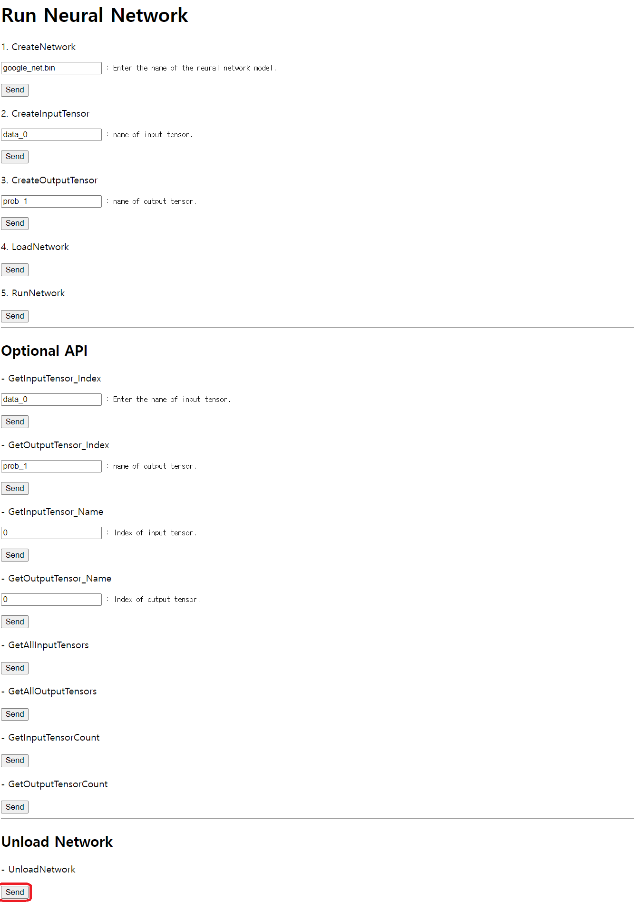

== run_neural_network

This application is designed to operate each neural network API. This
application includes APIs, such as CreateNetwork, CreateInputTensor,
CreateOutputTensor, LoadNetwork, and RunNetwork.

* Possible Scenario: +
Loading and running a neural network to receive processing results from the model is a possible scenario.

=== API

[cols=",,,",options="header",]
|===
|API |Return |Parameter |Description
|GetOrCreateNetwork |NeuralNetwork* |const string& name |Creates a
neural network instance when a neural network with the name you entered
does not exist.

|CreateInputTensor |shared_ptr |const string &name |Creates an input
tensor with a name specifically reserved for the model input

|CreateOutputTensor |shared_ptr |const string &name |Creates an output
tensor with a name specifically reserved for the model output

|LoadNetwork |bool |const string &bin |Loads a neural network into
memory

|RunNetwork |bool |stat_t & |Runs the neural network

|UnloadNetwork |void |- |Unloads a neural network from memory

|GetInputTensor |shared_ptr |const string &name |Gets an input tensor by
name

|GetInputTensor |shared_ptr |size_t index |Gets an input tensor by index

|GetOutputTensor |shared_ptr |const string &name |Gets an output tensor
by name

|GetOutputTensor |shared_ptr |size_t index |Gets an output tensor by
index

|GetAllInputTensors |vector<shared_ptr> |- |Gets all Input tensor

|GetAllOutputTensors |vector<shared_ptr> |- |Gets all output tensor

|GetInputTensorCount |size_t |- |Gets the count of Input tensor.

|GetOutputTensorCount |size_t |- |Gets the count of Output tensor.
|===

=== Using the Neural Network API

The methods listed below are examples of "google_net use".

* Create a neural network.
+
[source,cpp]
----
auto network = GetOrCreateNetwork("google_net.bin");
----
* Create a Input Tensor.
+
[source,cpp]
----
const shared_ptr<Tensor>& input_tensor(network->CreateInputTensor("data_0"));
----
* Create a Output Tensor.
+
[source,cpp]
----
const shared_ptr<Tensor>& output_tensor(network->CreateOutputTensor("prob_1"));
----
* Load a neural network into memory
+
[source,cpp]
----
bool result;
result = network->LoadNetwork("../res/ai_bin/google_net.bin");
----
* Run the neural network into memory
+
[source,cpp]
----
bool result;
stat_t stat = { 0, };
result = network->RunNetwork(stat);
----
* Unload a neural network from memory
+
[source,cpp]
----
network->UnloadNetwork();
RemoveNetwork("google_net.bin");
----
* Get an InputTensor using the tensor name.
+
[source,cpp]
----
const shared_ptr<Tensor> &input_tensor(network->GetInputTensor("data_0"));
----
* Get an InputTensor using the tensor index.
+
[source,cpp]
----
const shared_ptr<Tensor> &input_tensor(network->GetInputTensor(0));
----
* Get an OutputTensor using the tensor name.
+
[source,cpp]
----
const shared_ptr<Tensor>& output_tensor(network->GetOutputTensor("prob_1"));
----
* Get an OutputTensor using the tensor index.
+
[source,cpp]
----
const shared_ptr<Tensor>& output_tensor(network->GetOutputTensor(0));
----
* Get all InputTensors.
+
[source,cpp]
----
const vector<shared_ptr<Tensor>>& all_input_tensor(network->GetAllInputTensors());
----
* Get all OutputTensors.
+
[source,cpp]
----
const vector<shared_ptr<Tensor>>& all_output_tensor(network->GetAllOutputTensors());
----
* Get the number of InputTensors.
+
[source,cpp]
----
size_t input_tensor_count = network->GetInputTensorCount();
----
* Get the number of OutputTensors.
+
[source,cpp]
----
size_t output_tensor_count = network->GetOutputTensorCount();
----

=== Running Neural Network

* Click [Start] on the web page. +
 image:image/start_run_neural_network.png[image, 50%]
+
* Once the application is running, click [Go App]. +
 
+
* To run the neural network, click all [Send] buttons in order from the top.
[CreateNetwork]>[CreateInputTensor]>[CreateOutputTensor]>[LoadNetwork]>[RunNetwork]. +
 
 
+
* To terminate the neural network, click [Send] below [UnloadNetwork]. +
 
 image:image/result_run_neural_network2.png[image, 40%]
+
* To use the Optional API, create the network and tensor. +
 image:image/optionalapi_run_neural_network.png[image, 40%]

=== Building Application

[arabic]
. Build application.
+
....
$ APP_NAME=run_neural_network SDK_VER=24.06.14(your SDK version) SOC=[cv5, orinnx8g_jp512] docker compose up
$ docker compose down --remove-orphans
....
. Check the build results in current directory. If successful, you will be able to find the cap file.
